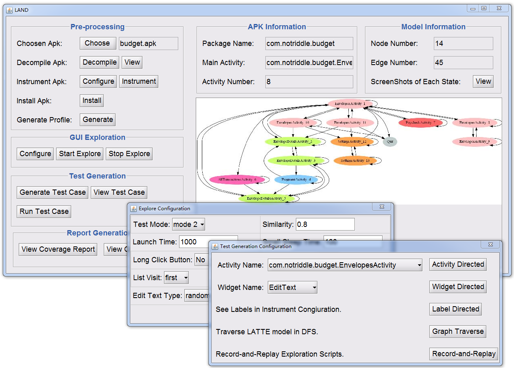

# LAND 

LAND is an automated testing tool for Android apps. 

<p align="center">

</p>

LAND is an effective and user-friendly test generation tool based on GUI exploration of Android apps, which constructs an elaborate window transition model "LATTE" that considers more Android specific characteristics and provides a customizable test generation interface by reusing the model.
    


## Publication ##
The paper PDF can be found at https://hanada31.github.io/pdf/issta18_land.pdf
```
@inproceedings{LAND2018,
  author    = {Jiwei Yan and
               Linjie Pan and
               Yaqi Li and
               Jun Yan and
               Jian Zhang},
  title     = {{LAND:} a user-friendly and customizable test generation tool for
               Android apps},
  booktitle = {Proceedings of the 27th {ACM} {SIGSOFT} International Symposium on
               Software Testing and Analysis, {ISSTA} 2018, Amsterdam, The Netherlands,
               July 16-21, 2018},
  pages     = {360--363},
  publisher = {{ACM}},
  year      = {2018},
  url       = {https://doi.org/10.1145/3213846.3229500},
}

```


# Steps:
1. Install Python 2.7
2. Install Java 1.8
3. Install GraphViz (windows) and add "Graphvizxx\bin" into the environment variable "path"
4. Run dot -c (as the root user) to update the config file
5. Open an Android emulator or Android device
5. Run land.jar "java -jar land.jar"

# Note that:
1. This tool can only run on Windows.
2. The configration file for each app under test is "profile\appName\profile.txt", in which oo short sleeptime or too small will lead to incomplete model.
